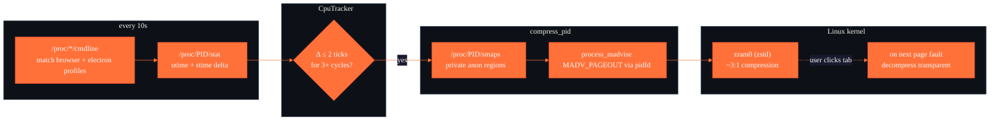

<div align="center">


[](https://www.rust-lang.org/)
[](https://kernel.org/)
[](https://www.mozilla.org/firefox/)
[](https://www.chromium.org/)
[](https://www.electronjs.org/)
[](https://wiki.archlinux.org/title/Zram)
[](./LICENSE)

**588 MiB → 171 MiB. The pages were never touched, so nobody cares.**

---

*"Browsers ask for RAM. The kernel delivers. bssl-ram whispers to the kernel."*

</div>

---

> [!IMPORTANT]
> **bssl-ram is a tiny autonomous daemon that shrinks idle browser tabs and Electron windows by ~70% RSS without the app
noticing.**
> Out of the box it covers Firefox, LibreWolf, Zen, Waterfox, Chrome, Chromium, Brave, Edge, Vivaldi, Opera, Discord,
> Slack, VS Code, Spotify, Obsidian and basically any other Electron-based desktop app. It doesn't restart, discard, or
> reload anything. It just tells the kernel "page this out to zram — the user isn't looking". When the tab comes back, the
> kernel decompresses transparently on page fault. The app never learns this happened.

---

## ⚡ Quick Start

```bash
# 1. Build
cd daemon && cargo build --release

# 2. Make sure zram is on (Arch)
sudo pacman -S zram-generator

# 3. Install + enable the system template service for your user
sudo install -Dm755 target/release/bssl-ram /usr/local/bin/bssl-ram
sudo install -Dm644 systemd/bssl-ram@.service /etc/systemd/system/bssl-ram@.service
sudo systemctl daemon-reload
sudo systemctl enable --now bssl-ram@$USER.service

# 4. Watch it work
journalctl -u bssl-ram@$USER -f
```

The daemon runs as **your user** (not root) with `CAP_SYS_NICE` +
`CAP_SYS_PTRACE` ambient capabilities — enough to satisfy
`ptrace_may_access()` against your own Firefox without `sudo`.
Full setup notes: [`daemon/systemd/README.md`](daemon/systemd/README.md).

Prefer no systemd? Skip step 3 and use file capabilities:

```bash
sudo setcap cap_sys_nice,cap_sys_ptrace+eip /usr/local/bin/bssl-ram
/usr/local/bin/bssl-ram   # runs without sudo
```

Dry-run first if you're paranoid:

```toml
# /etc/bssl-ram/config.toml
dry_run = true
```

---

## 🏗️ Architecture



The daemon is a single Tokio loop driven by **two wake sources**: a safety-net timer (`scan_interval_secs`) and an event-driven PSI memory-pressure trigger. When the system is comfortable, the daemon idles between timer ticks and burns essentially zero CPU. When the kernel reports real memory stall (`/proc/pressure/memory` crosses the configured threshold), `poll(POLLPRI)` fires and the daemon scans immediately — no waiting for the next tick. Every `scan_interval_secs` it:

1. Walks `/proc` and matches each cmdline against the configured **profiles**. Firefox tabs use `-isForBrowser ... tab`;
   everything Chromium-based (Chrome, Brave, Edge, Vivaldi, Opera, *and* every Electron app) carries `--type=renderer`.
   Extension renderers (`--extension-process`) and infrastructure procs (gpu/utility/zygote/crashpad/rdd/socket) are
   excluded.
2. Reads `utime + stime` from `/proc/PID/stat` and diffs against the previous snapshot. Targets that burn ≤ 2 ticks (
   20ms CPU) per cycle for 3 consecutive cycles are flagged idle.
3. Parses `/proc/PID/smaps`, selects only **private anonymous** regions (perms `p`, inode 0, `Anonymous: > 0 kB`), and
   batches them through `process_madvise(pidfd, iov, MADV_PAGEOUT)` in chunks of `IOV_MAX=1024`.

That's the whole thing. No ptrace, no signals, no process suspension. The kernel handles decompression on demand — the
app doesn't know its pages moved.

---

## 📊 What actually happens

Measured on a real Firefox tab with 588 MiB RSS, using `examples/compress_real.rs`:

| Metric           |  Before |   After |                      Δ |
|:-----------------|--------:|--------:|-----------------------:|
| **RSS**          | 588 MiB | 171 MiB |    **−417 MiB (−70%)** |
| **PSS**          | 493 MiB |  65 MiB |               −428 MiB |
| **Swap (zram)**  |   3 MiB | 374 MiB |           **+374 MiB** |
| **Syscall time** |       — |       — | 1.38s for 1000 regions |

Net physical RAM returned to the system after zstd compression: about **260 MiB** from a single tab. Firefox continued
running. The tab, when switched back to, was indistinguishable from a non-compressed one.

---

## ⚙️ Configuration

`/etc/bssl-ram/config.toml` — all fields optional, defaults shown:

```toml
scan_interval_secs = 10   # seconds between /proc scans (safety-net cap when PSI is on)
idle_cycles_threshold = 3    # consecutive idle cycles before compressing (3 × 10s = 30s)
cpu_delta_threshold = 2    # CPU ticks per cycle to be considered idle (2 ticks = 20ms)
wakeup_delta_threshold = 50  # CPU ticks/cycle that count as a real user wakeup (≥ 500ms CPU)
min_rss_mib = 50   # don't bother compressing tiny processes
dry_run = false

# PSI memory pressure trigger -------------------------------------------------
# When enabled, the daemon also wakes up immediately whenever the kernel
# reports `psi_stall_threshold_us` of cumulative memory stall inside any
# rolling `psi_window_us` window. Idle systems → near-zero CPU; pressure
# spikes → reaction in the same cycle. Requires CAP_SYS_RESOURCE
# (granted by the systemd unit). On any failure (kernel without
# CONFIG_PSI, missing cap, …) the daemon logs a warning and silently
# falls back to timer-only mode.
psi_enabled            = true
psi_stall_threshold_us = 150000   # 150 ms of "some-tasks-stalled"
psi_window_us          = 1000000  # ... within any 1 s window

# Profiles are how the scanner decides what counts as a "compressible
# target". The defaults below cover Firefox-family + Chromium-family +
# every Electron app — you only need this section if you want to add new
# match rules or replace the defaults.
#
# [[profiles]]
# name = "my-app"
# binary_substring_any = ["myapp"]   # case-insensitive substrings of argv[0]
# arg_required_all     = ["--worker"]
# arg_excluded_any     = ["--debug"]
# arg_last             = "tab"
```

### Supported apps (built-in profiles)

| Profile    | Matches                                                                                                                                                                                                                                                                                |
|:-----------|:---------------------------------------------------------------------------------------------------------------------------------------------------------------------------------------------------------------------------------------------------------------------------------------|
| `firefox`  | Firefox, LibreWolf, Zen Browser, Waterfox, IceCat — any tab content process (`-isForBrowser ... tab`)                                                                                                                                                                                  |
| `chromium` | Chrome, Chromium, Brave, Edge, Vivaldi, Opera, Yandex, Thorium, **and every Electron app** (VS Code, Discord, Slack, Spotify, Obsidian, Signal, Notion, Element, Teams, Vesktop, …) — any `--type=renderer` content process. Extension renderers (`--extension-process`) are excluded. |

---

## 🧪 Development

The daemon ships with four inspection examples that bypass the main loop and let you validate each subsystem in
isolation:

```bash
# list PIDs the scanner finds — diff against `ps aux | grep isForBrowser`
cargo run --example scan_test

# watch CPU ticks per tab live (env: CYCLES, INTERVAL)
cargo run --example cpu_test

# inspect smaps parsing without compressing anything
cargo run --example compress_test

# real compression with before/after RSS (needs sudo)
sudo ./target/debug/examples/compress_real
```

---

## 📦 Requirements

| Requirement                       | Why                                                                                |
|:----------------------------------|:-----------------------------------------------------------------------------------|
| Linux kernel ≥ 5.10               | `process_madvise` and `pidfd_open` syscalls                                        |
| zram configured as swap           | Without it, pages go to disk — defeats the point                                   |
| `CAP_SYS_NICE` + `CAP_SYS_PTRACE` | Granted by the systemd unit or via `setcap` — no permanent root                    |
| At least one supported app        | Firefox, any Chromium-based browser, or any Electron app (see profile table above) |

---

## 🧯 Known limitations

- **No per-tab granularity.** Browsers group same-site tabs into one process (Fission in Firefox, site-per-process in
  Chromium) — compressing one compresses all siblings. Acceptable since they'll all idle together.
- **Background media detection.** A tab playing audio through MSE may show low CPU delta because the actual decoding
  happens in a sibling decoder process. Future work: a D-Bus MPRIS listener to globally block compression during
  `PlaybackStatus=Playing`.
- **WebRTC / Meet / Zoom.** These rarely expose `MediaSession`, so MPRIS won't help. Future work: a minimal Native
  Messaging Host as a cooperative "please don't compress" signal from the page.
- **Cold-start latency.** The first access after compression pays a page-fault roundtrip plus zstd decompression (
  sub-100ms for typical working sets — noticeable but not painful).

---


<div align="center">

**`bssl` — browsers should suckless.**

</div>
