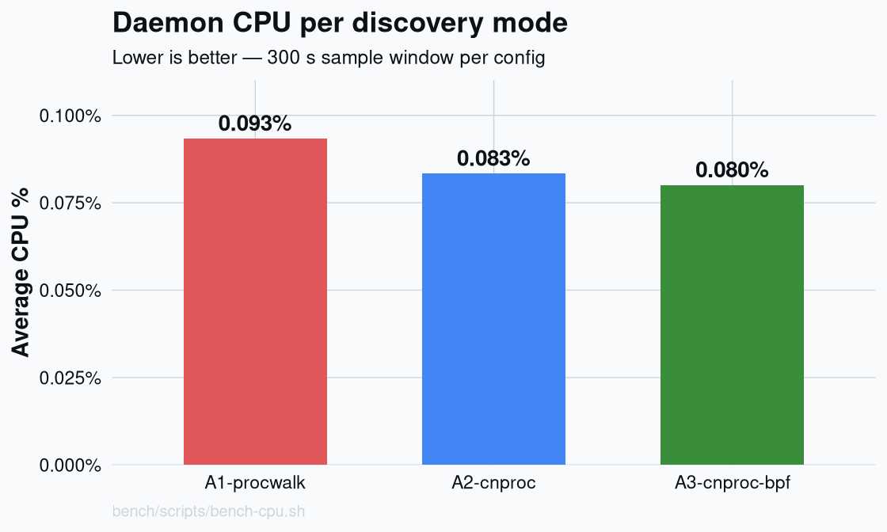
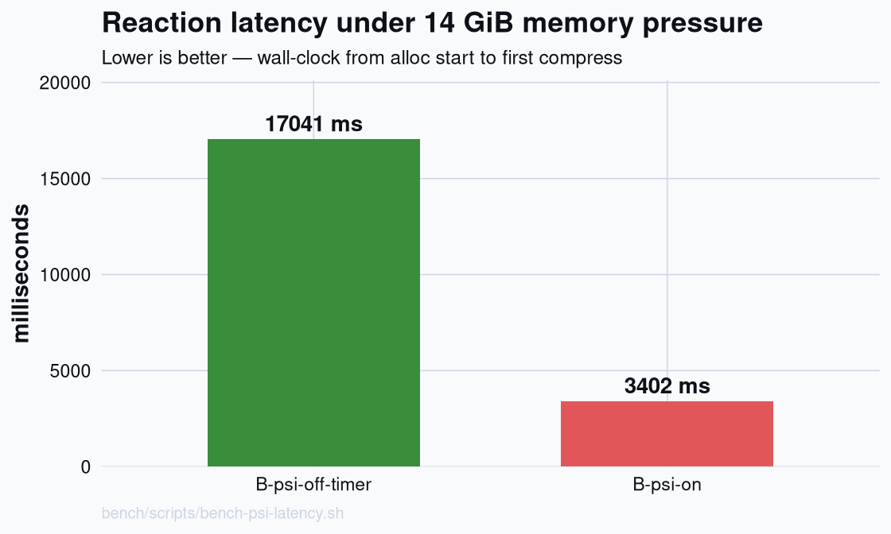
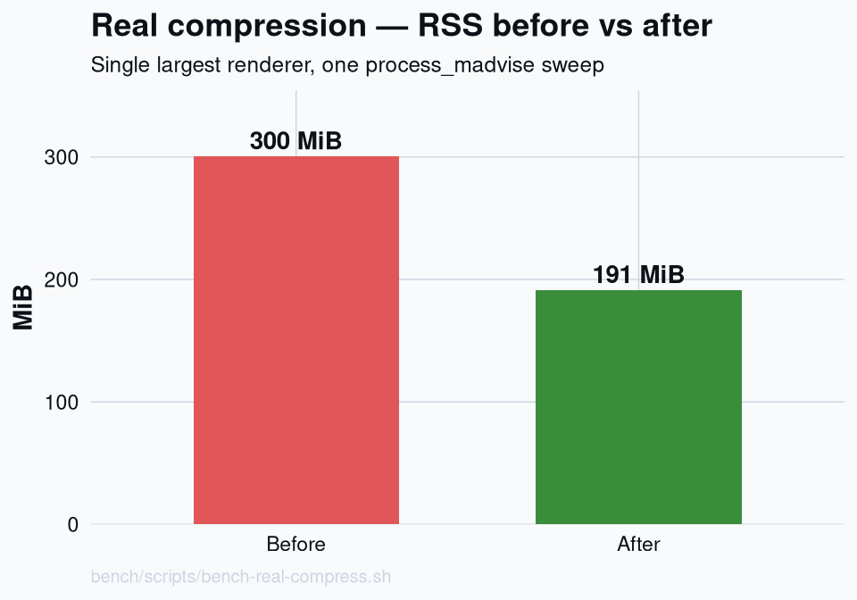
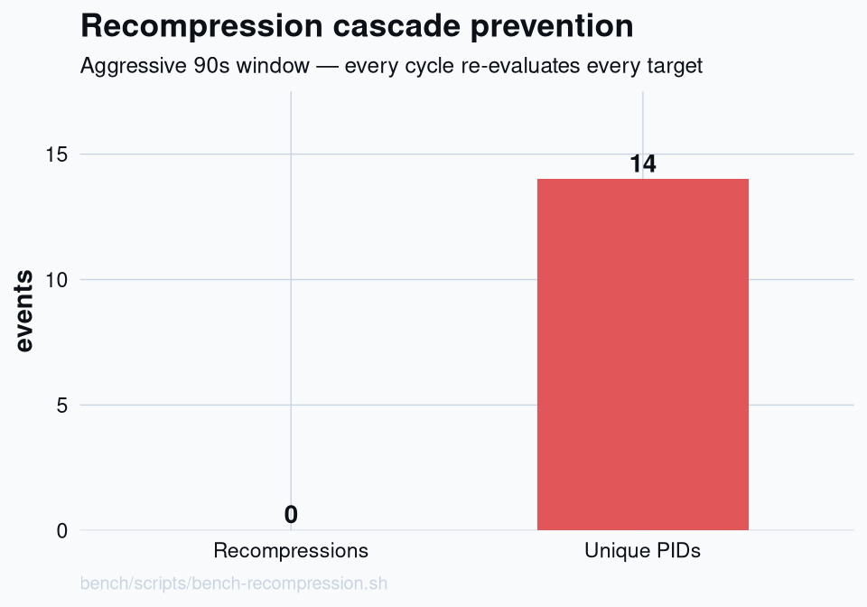

# bssl-ram — benchmark report

Generated: 2026-04-22 18:53:09 -03

> Regenerate with `Rscript bench/analyze.R`. Aggregated across every
> timestamped run currently under `bench/results/`.

## Test A — daemon CPU per discovery mode

Aggregated across 1 run(s).

<picture>
  <source media="(prefers-color-scheme: dark)" srcset="results/plots/test-a-cpu-dark.png">
  
</picture>

| Config | Runs | Mean CPU % | Std-dev | Min % | Max % |
| :--- | ---: | ---: | ---: | ---: | ---: |
| A1-procwalk | 1 | 0.0933 | — | 0.0933 | 0.0933 |
| A2-cnproc | 1 | 0.0833 | — | 0.0833 | 0.0833 |
| A3-cnproc-bpf | 1 | 0.0800 | — | 0.0800 | 0.0800 |

## Test B — PSI reaction latency under 14 GiB allocation

<picture>
  <source media="(prefers-color-scheme: dark)" srcset="results/plots/test-b-psi-latency-dark.png">
  
</picture>

| Mode | Runs | Mean ms | Std-dev | Min ms | Max ms |
| :--- | ---: | ---: | ---: | ---: | ---: |
| B-psi-off-timer | 1 | 17041 | — | 17041 | 17041 |
| B-psi-on | 1 | 3402 | — | 3402 | 3402 |

## Test C — real compression on largest renderer

<picture>
  <source media="(prefers-color-scheme: dark)" srcset="results/plots/test-c-rss-before-after-dark.png">
  
</picture>

| Run | Before MiB | After MiB | Δ MiB | Δ % | Syscall ms |
| :--- | ---: | ---: | ---: | ---: | ---: |
| 20260422-183001 | 300 | 191 | 109 | 36.3% | 398 |

## Test E — recompression cascade prevention

<picture>
  <source media="(prefers-color-scheme: dark)" srcset="results/plots/test-e-recompression-dark.png">
  
</picture>

| Run | Total events | Unique PIDs | Recompressions | Rate % |
| :--- | ---: | ---: | ---: | ---: |
| 20260422-182823 | 14 | 14 | 0 | 0.0% |

## Plots

Written to `bench/results/plots/`:

- `test-a-cpu-{light,dark}.png`
- `test-b-psi-latency-{light,dark}.png`
- `test-c-rss-before-after-{light,dark}.png`
- `test-e-recompression-{light,dark}.png`

