<div align="center">


[](https://developer.chrome.com/docs/extensions/develop/migrate)
[](https://www.mozilla.org/firefox/)
[](https://www.chromium.org/)
[](https://developer.chrome.com/docs/extensions/develop/concepts/native-messaging)
[](../LICENSE)

**Conservative veto signals. No browsing tracked. No page content sent.**

---

*"The daemon decides. The extension only says: hey, this tab still matters."*

</div>

---

> [!IMPORTANT]
> The daemon decides by itself whether a renderer is compressible; this
> extension sends extra context that `/proc` cannot infer, so the daemon
> can **veto** compression when the page is still meaningful to the user.
> Never a "compress this PID" signal — always a "don't compress this
> family right now" hint.

It does not track browsing, does not send page content, and does not
store anything identifying beyond a per-install UUID used to tell two
browser profiles apart.

---

## 🗂️ Signals reported

Two tiers, by user consent.

### Coarse signals (always on — zero extra permissions)

| Signal                           | Source                | What it catches                                  |
|:---------------------------------|:----------------------|:-------------------------------------------------|
| Focused window                   | `chrome.windows`      | "Browser is in the foreground right now"         |
| Audible tabs                     | `chrome.tabs.audible` | Audio playback (incl. background tabs)           |
| Active / hidden / discarded tabs | `chrome.tabs`         | Basic lifecycle for the daemon's per-family veto |
| System idle state                | `chrome.idle`         | `active` / `idle` / `locked`                     |

### Rich signals (opt-in from Options — requires `<all_urls>`)

| Signal                 | Source                       | What it catches                              |
|:-----------------------|:-----------------------------|:---------------------------------------------|
| Page visibility        | `document.visibilityState`   | Tab on-screen vs obscured                    |
| Document focus         | `document.hasFocus()`        | Keyboard target                              |
| Fullscreen / PiP       | `document.fullscreenElement` | Immersive media                              |
| Playing media elements | `<audio>` / `<video>` scan   | MSE / WebRTC streams `tab.audible` misses    |
| Last user interaction  | pointer / keyboard / wheel   | "User just touched this — don't page it out" |

The content script is registered **programmatically** via
`chrome.scripting.registerContentScripts` only after the user has
granted `<all_urls>` on the options page. Revoking the permission
unregisters it. No static `content_scripts` block in the manifest.

---

## 🏗️ Transport — protocol v1

Native Messaging Host + Unix domain socket. No HTTP, no network
sockets, no `host_permissions`.

```mermaid
%%{init: {'theme': 'base', 'themeVariables': {
  'primaryColor': '#ff7139',
  'primaryTextColor': '#f8fafc',
  'primaryBorderColor': '#ce422b',
  'lineColor': '#ff7139',
  'secondaryColor': '#1a1a2e',
  'tertiaryColor': '#0d1117',
  'clusterBkg': '#0d1117',
  'clusterBorder': '#334155',
  'textColor': '#f8fafc',
  'fontFamily': 'ui-monospace, monospace'
}}}%%
flowchart LR
    subgraph B["🧩 browser process"]
        EXT["extension service worker<br/>chrome.runtime.connectNative"]
    end

    subgraph BR["🪢 bssl-ram-bridge"]
        NMH["stdio: 4-byte LE length<br/>+ UTF-8 JSON"]
    end

    subgraph D["🧠 bssl-ramd"]
        SOCK["/run/bssl-ram/signals.sock<br/>mode 0600, SO_PEERCRED uid check"]
        AXUM["axum router<br/>/v1/signals/{ping,report}"]
    end

    EXT -- "connectNative(&#39;io.bssl.ram&#39;)" --> NMH
    NMH -- "HTTP/1 over UDS" --> SOCK --> AXUM
```



- The extension calls `chrome.runtime.connectNative("io.bssl.ram")`.
  The browser looks up `io.bssl.ram.json` under
  `~/.config/<browser>/NativeMessagingHosts/` (or
  `~/.mozilla/native-messaging-hosts/`), spawns the bridge binary with
  a stdio pipe, and passes the extension origin as `argv[1]`.
- The bridge forwards framed `{kind:"ping"}` and
  `{kind:"report", payload:...}` messages to the daemon over a Unix
  socket. Daemon UID check (`SO_PEERCRED`) is the real trust boundary.
- Replies come back through the same pipe to the extension.

Install flow:
[`../INSTALL.md`](../INSTALL.md) →
`bssl-ram-bridge install --user --chrome-ext-id <id>`.

---

## 📦 Report shape (v1)

```jsonc
{
  "version": 1,                       // legacy alias, removed in v2
  "protocol_version": 1,
  "veto_ttl_ms": 60000,               // hint: how long this veto should hold
  "sent_at_ms": 1713720000000,
  "browser": {
    "family": "firefox",              // daemon-canonicalized: firefox | chromium
    "instance_id": "550e8400-…",      // UUID v4 persisted in storage.local
    "system_idle_state": "active"
  },
  "summary": {
    "tabs_total": 12,
    "audible_tabs": 1,
    "hidden_tabs": 3,
    "discarded_tabs": 0,
    "active_tabs": 2,
    "focused_windows": 1,
    "content_samples": 5
  },
  "tabs": [
    {
      "tab_id": 123,
      "window_id": 4,
      "active": false,
      "audible": false,
      "hidden": true,
      "discarded": false,
      "last_accessed_ms": 1713719995000,
      "window_focused": false,
      "url_origin": "https://example.com",   // origin-only, never path/query
      "content": {
        "visibility_state": "hidden",
        "document_has_focus": false,
        "fullscreen": false,
        "picture_in_picture": false,
        "media_elements": 1,
        "playing_media_elements": 0,
        "last_user_interaction_ms": 1713719900000,
        "sampled_at_ms": 1713720000000
      }
    }
  ]
}
```

Every field is optional on the wire — the daemon uses
`#[serde(default)]` — so older extensions and the v1 daemon continue
to interoperate.

---

## 🛑 Veto semantics (daemon side)

The daemon treats a fresh report as authoritative for the whole matching
browser *family* until `signal_ttl_secs` expires. First match wins:

| Priority | Reason               | Triggers when…                                                                          |
|:---------|:---------------------|:----------------------------------------------------------------------------------------|
| 1        | `audible-tab`        | Any tab has `audible: true`.                                                            |
| 2        | `playing-media`      | Sum of `playing_media_elements` across rich signals > 0.                                |
| 3        | `focused-window`     | Any tab has `window_focused: true`.                                                     |
| 4        | `recent-interaction` | Any rich signal's `last_user_interaction_ms` is within `signal_interaction_grace_secs`. |

> [!NOTE]
> There is no stable tab → PID mapping on Firefox or Chromium stable, so
> a veto currently applies to **all** renderers of the matching family.
> Intentionally coarse. A more granular model would need privileged
> `browser.processes` APIs we don't have.

---

## ⚙️ Service-worker lifecycle — what we actually design for

> [!WARNING]
> MV3 SWs die after ~30 s of idle. Every top-level `let` / `const` is
> re-initialized on wake. In-flight `fetch()` and `setTimeout` do **not**
> keep the SW alive. We design against the real lifecycle.

- `chrome.alarms`, never `setTimeout`. Two named alarms:
  - `bssl-ram-report-tick` — periodic safety-net, 30 s in stable
    Chrome, ~1 s in unpacked.
  - `bssl-ram-report-debounce` — one-shot, recreated per event.
- `tabSignals` is mirrored into `chrome.storage.session` as an array
  (Maps round-trip as empty `{}` through session storage). Rehydrated
  at every top-level SW run.
- Instance identity is a `crypto.randomUUID()` persisted in
  `chrome.storage.local` on first install.
- Browser family, idle state and instance ID are fetched inside
  `buildReport()` so a report built after a cold SW start is still
  complete.

---

## 🧭 Options page

`chrome://extensions → bssl-ram signals → Extension options`:

| Row               | Content                                                                      |
|:------------------|:-----------------------------------------------------------------------------|
| Daemon status     | `reachable` (green) / `protocol mismatch` (warn) / `unreachable` (red).      |
| Protocol          | `v1` from the daemon's ping.                                                 |
| Accepted families | `firefox, chromium` (from the ping response).                                |
| Max report        | `~1024 KiB` body-size cap.                                                   |
| Transport         | `native-messaging-uds` — confirms we're not on the TCP fallback.             |
| Bridge            | `bssl-ram-bridge` version.                                                   |
| Extension         | version, browser family, instance UUID, last failure timestamp.              |
| Rich signals      | Opt-in toggle — hits `chrome.permissions.request({origins:["<all_urls>"]})`. |

---

## 🔐 Permissions footprint

### Required (baseline)

`tabs`, `windows`, `idle`, `alarms`, `storage`, `scripting`,
`nativeMessaging`.

### Optional (rich mode)

`<all_urls>` in `optional_host_permissions`. Granted / revoked through
the options page via `chrome.permissions.request` / `.remove`.

### Explicitly NOT asked for

- Any `host_permissions` at all — the extension no longer speaks HTTP.
- `webRequest`, `webNavigation`, `downloads`, `history`, `bookmarks`,
  `cookies` — anything that touches user data.

---

## 🧪 Local testing

See [`../INSTALL.md`](../INSTALL.md) for the complete install flow.
Short version:

```bash
# build daemon + bridge
cargo build --release --workspace
sudo install -Dm755 target/release/bssl-ram /usr/local/bin/bssl-ram
sudo install -Dm755 target/release/bssl-ram-bridge /usr/local/bin/bssl-ram-bridge

# start daemon with signal_server_enabled = true in /etc/bssl-ram/config.toml
sudo systemctl enable --now bssl-ram@$USER

# write NMH manifests (Firefox is fixed-ID; Chromium needs the ext ID)
bssl-ram-bridge install --user --chrome-ext-id <id-after-loading-unpacked>
```

Then load the extension at `about:debugging` (Firefox) or
`chrome://extensions` (Chromium) and open the Options page — status
should show *reachable*.

If the daemon isn't running, report delivery fails silently — the
daemon never force-compresses on absence of data, so the feature
degrades safely to `/proc`-only heuristics.

---

## 🧭 See also

- [`../README.md`](../README.md) — project overview and numbers.
- [`../INSTALL.md`](../INSTALL.md) — end-to-end install.
- [`../daemon/systemd/README.md`](../daemon/systemd/README.md) —
  systemd unit and capability model.
- [`../bench/README.md`](../bench/README.md) — reproducible benchmarks.
- [`../SECURITY.md`](../SECURITY.md) — threat model for the ambient-caps
  daemon plus the NMH / UDS trust boundary.

---

<div align="center">

**`bssl` — hints that the daemon can trust.**

</div>
